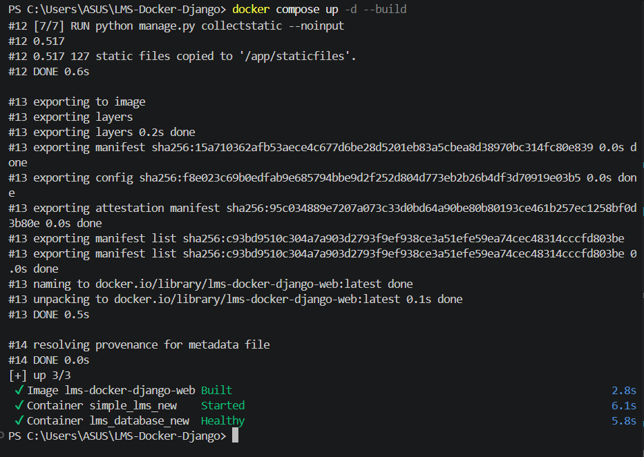
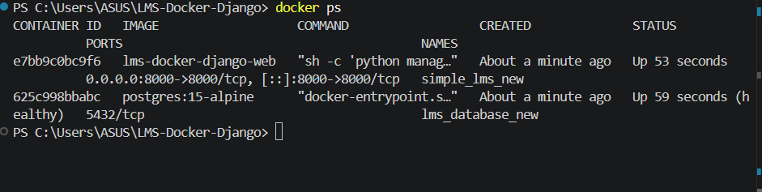
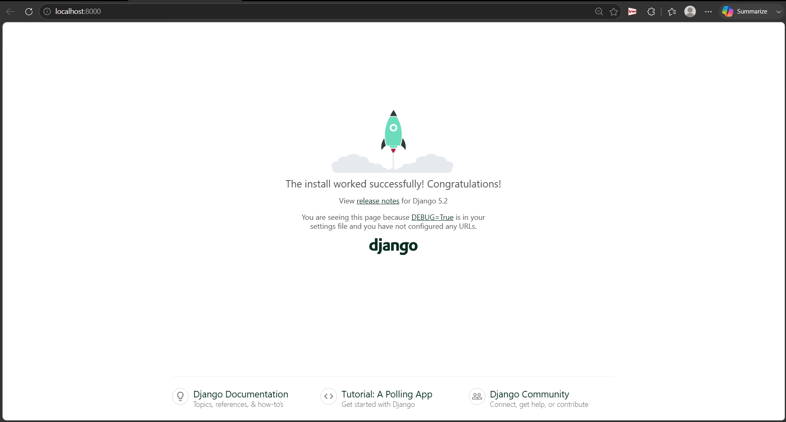
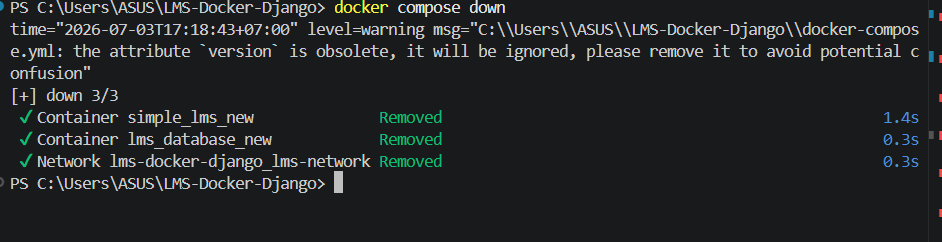
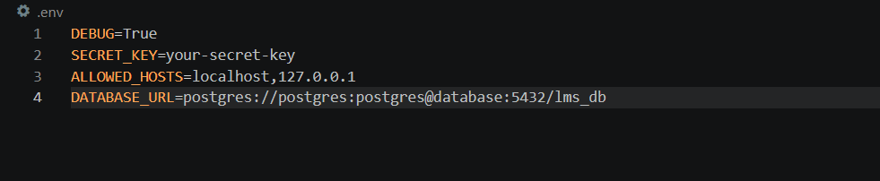

# Progress 1: Simple LMS - Docker & Django Foundation

## Langkah-langkah Menjalankan Project

## 1. Clone Repository

- git clone https://github.com/Fabianadam21/simple-lms1.git

## 2. Menjalankan Docker

- docker-compose up -d --build
  

## 3. Cek Container Berjalan atau belum

- docker ps
  

## 4. Mengakses Aplikasi

Buka browser dan akses: http://localhost:8000

## 5. Memberhentikan Project

- docker compose down

# Environment Variables

konfigurasi file .env :

